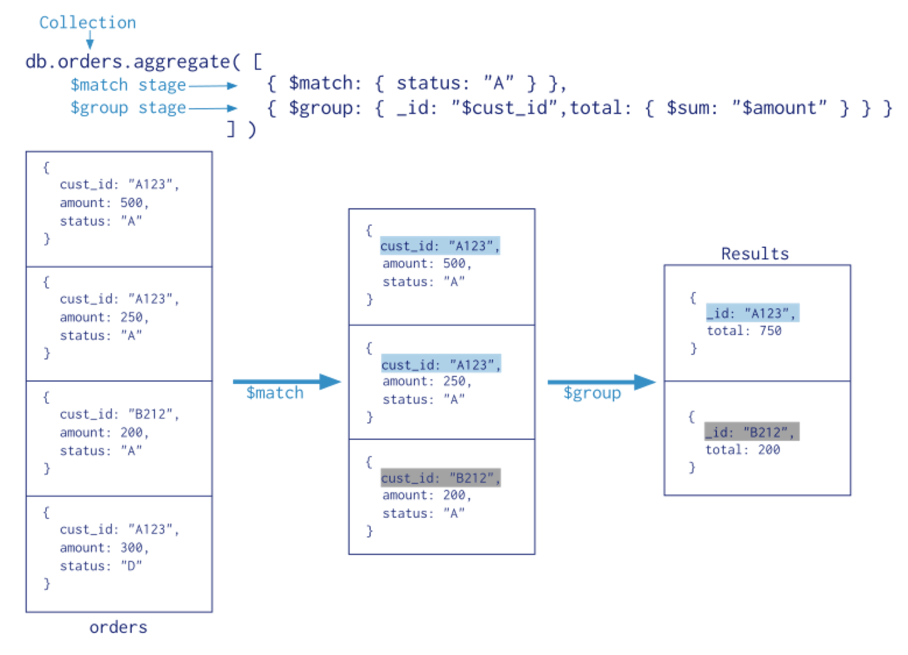

# Operations 

## Limit 

Limit is a function that will reduce the number of records to a particular number irrespective of
how many records are returned by the query. 

* `db.customers.find().limit(2)`  -- will give me only the first 2 records in the collection. 

## Sort 

Sort operation will sort the entire results set returned from the query based on a field. Here is
the syntax: 

`db.<collection>.find().sort(<field to sort on>: <1 for ascending or -1 for decending>)`

example:  
* `db.customers.find().sort({name:1}).limit(3)`
* `db.customers.find().sort({name:1}, {age: 1}).limit(3)` -- there can be multiple sort criteria
  where the first one is the main criteria and other are secondary sort criteria. 

## Aggregation 

bring different data together. These functions can count, average and others as well. 

**count** 

* `db.customers.find().count()` 

**distinct** 
* `db.customers.distinct("role")`

**aggregate** - this operation is done in stages and here is how we can visualize the aggregate 



The syntax for aggreate is as follows: 

`db.<collection-name>.aggregate([{match, sort, goeNear}, {group}])`

inserting the relevant data 

```
db.orders.insert([
{"cust_id":"A123","amount":500,"status":"A"},
{"cust_id":"A123","amount":250,"status":"A"},
{"cust_id":"B212","amount":200,"status":"A"},
{"cust_id":"A123","amount":300,"status":"D"}
])
```

Example: 
```
db.orders.aggregate([
   {$match: {status: "A"}}, 
   {$group: {_id: "$cust_id", total: {$sum: "$amount"}}} 
])
```

for more on aggregation check out manual from mongodb on aggregation -
[source](https://docs.mongodb.com/manual/aggregation/) 
